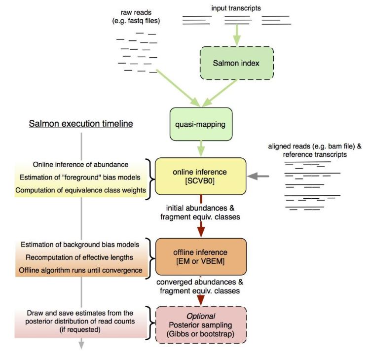

---
output:
  pdf_document: default
  html_document: default
---
# Methods

## FastQC 

`FastQC` was used to do initial analysis on the raw data quality. The`.html` output from this analysis can be found [here](./FASTQC). The vast majority of quality checks were fine for all the reads, there was a flag for the `Per base sequence content` but upon examination, the variation was only at the start of the read and the quality score in that region was still above 32 so no action was taken to specifically address this. Another flag that was raised was w.r.t the `Kmer Content`. These over-represented sequences were across the read and no flags were raised for adapters. No trimming was done in the paper this data was borrowed from, so nothing was done in this case as well. 

## HISAT2

The Hierarchical Indexing for Spliced Alignment of Transcripts 2 (Kim et al., 2019) or HISAT2 is an aligner that is splice aware and maps reads to a reference genome. It is based on the Ferragina Manzini index (FMI) that is the bases for bowtie2. HISAT2 is a splice-aware aligner, meaning it can map non-contiguous reads. Since the raw data has already been spliced and the full genome is provided as reference it has the capacity to find minor matches at the start or end of a given exon and map across to the next exon in a give gene. It accounts for minor SNPs and other variations in real RNA-seq data that is not necessarily represented in the reference sequence. 

Fig. 2 was borrowed from Kim et al., it shows the scheme used by HISAT2 to map reads to the reference. The key things to note here are that this tool created two indexes. There is the global index that places a read in a specific location of the genome (can be just 28bp) and a local index that has smaller section of the genome (can be 56 bp) to allow short overhangs of splice sites to be mapped accurately. 


First, the mm10 mouse reference genome from [gencode](https://www.gencodegenes.org/mouse/) was used within `hisat-build` to construct an index. 

```
hisat2-build -f mm10.ref.fa mm10
```
This index is then used within hisat2 for read mapping. This function can be customized in a variety of ways, full list of options found [here](https://daehwankimlab.github.io/hisat2/manual/). Here we used the following flags:

1. `-p` = specifies the number of threads to use. Default is 1. 
2. `-q` = tells the system that the input here are `.fastq` files 
3. `-U` = the list of files to be used as input 
4. `-S` = the destination for the `.sam` file that contains the alignment information for each sample
5. `-x` = specifies the prefix of the hisat2 index used in the previous step

```
hisat2 -p 8 -q -x mm10 -U ${sample_dir}/day7_control1.fastq -S ${out_dir}/day7_control1.sam
```

## Samtools

Samtools is a very useful set of programs that can handle SAM and BAM files in preparation for counting. Here some of the tools were used in order to process `.sam` files generated from HISAT2. Full list of functionalities can be found [here](https://www.htslib.org/).

Here four function were used in order to process the HISAT2 output: 

#### 1. SAM to BAM 

Converting `.sam` files into `.bam` files. A part of the samtools view function, this process takes two main arguments:

1. `-b` = indicates that input file is a `.bam` file
2. `-S` = directory where `.sam` file lives

```
samtools view -b -S ${sam_dir}/${base}.sam > ${bam_dir}/${base}.bam
```
#### 2. Sorting and Indexing BAM files

These functions sort and index BAM files based on the genomic coordinates for downstream filtering based on alignment quality, taking two main arguments: 

1. `-o` = destination for sorted file
2. `-b` = directory of sorted `.bam` file

```
samtools sort -o ${bam_sort}/${base}.bam ${bam_dir}/${base}.bam
samtools index -b ${bam_sort}/${base}.bam ${bam_sort}/${base}.bam.bai
```
These tools work well together in for loops so can be great to use at the same time. 

#### 3. Filtering BAM files 

The filter function is another feature built into samtools view. It is used to filter reads that did not map anywhere (MAPQ = 0) as well as reads that mapped in multiple locations of the genome (MAPQ = 1). Since HISAT2 generates three MAPQ scores, the unique reads being a MAPQ of 60 it can be easy to filter the rest out. There a many more parameters upon which filtering can be done. Since no parameters were provided by the authors no other settings were used here. 

To filter `.bam` files three arguments are needed: 

1. `-b` = indicates that input file is a `.bam` file
2. `-q` = the minimum number for the MAPQ score in order to keep in filtered list
3. `-o` = output directory for filtered files

```
samtools view -b -q 40 -o ${out_dir}/${base}.bam ${in_dir}/${base}.bam
```

## featureCounts

Feature counts is a commonly used software that can quantify `.bam` files. It can be run on the terminal or from within the `Rsubread` bioconductor package. It reports raw counts for reads mapping to a features specified by a supplied `.gtf` file for genome annotations. The tool uses the schematic in Fig. 3 to count reads. 


All filtered `.bam` files can be stored within a variable in R using the `file.path()` function. This can then be called within featureCounts along with: 

1. `annot.ext` = annotated `.gtf` file 
2. `isGTFAnnotationFile` = indication that annotation file is a `.gtf` 
3. `GTF.featureType` = type of feature to assign counts by. Can be genes or transcripts
4. `GTF.attrType` = count matrix will be generated based on this attribute
5. `countMultiMappingReads` = choice of whether to include sequences that map multiple times. Here we chose to do this because all reads that mapped multiple aspects of the genome have already been filtered out and choosing `FALSE` here can eliminate 20-30% of all data. 

```
featureCounts(bam_files, annot.ext = 'mm10.ref.gtf', 
  isGTFAnnotationFile = TRUE, 
  GTF.featureType = 'gene', 
  GTF.attrType = 'gene_id', 
  countMultiMappingReads = TRUE)

```

For more detail check out the Harvard Chan Bioinformatics core page on counting [here](https://hbctraining.github.io/Intro-to-rnaseq-hpc-O2/lessons/05_counting_reads.html)

Count matrix for all data can be found under `str_counts.csv` in the project repo. 

## Kallisto 

Kallisto is another psudoaligner that was used here to quantify abundance. (Bray et al., 2016) Instead of mapping to a specific location in the whole genome, it maps to the potiential position in the transcriptome. This means this method of mapping is much faster, but it also means, novel splice sites and transcripts are discarded if they do not already belong to the reference transcriptome. 

The kallisto index is builds a de Bruijin graph of k-mers. Mechanism of mapping is illustrated in Fig. 4 from Bray et al. Each circle represents a k-mer. Since the index stores the map of k-mers to their corresponding transcript and k-mers are used to extend the read along a path that leads to transcript identification. Unlike a classical aligner, kallisto combines the alignment and quantification under one function removing the need to secondary software before DESeq2 analysis. 


The index is build by simply supplying the transcriptome and `-i` indicates the prefix for the index file. 

```
kallisto index -i kal_index mm10.transcript.fa
```
This index is then called within kallisto quant. This function takes several arguments found [here](https://pachterlab.github.io/kallisto/manual). 

1. `-i` = directory that contains index files 
2. `-o` = output directory for quantification 
3. `--single` = in this case no sample was paired so this flag is necessary to indicate that
4. `-l` = since reads are not paired, average length needs to be provided. It is typically between 180 and 200 for illumina reads. Since Salmon analysis was performed first, this information was extracted with metadata. 
5. `-s` = standard deviation in `-l` value 
6. `-t` = number of threads to be used

```
kallisto quant -i ${index_dir} \
-o ${out_dir}/${basename} \
${sample_dir}/${basename}.fastq \
--single -l 250 -s 25 -t 16
```

## Salmon

Salmon is another pseudoaligner that uses k-mer counting similar to kallisto. It claims to handle sample specific and GC bias better than kallisto. (Patro et al., 2017) It follows a similar quasimapping scheme at the start and then through the various online and offline phases arrives at the bias estimates. Fig. 5 from Patro et al. illustrates this process.



One advantage of salmon is that it can quantify both `.fastq` and `.bam` files generated from traditional aligners making it a versatile tool overall. To start the analysis as with all the tools discussed so far, an index is generated. Since this method uses a transcriptome. 

Salmon index takes two arguments:

1. `-t` = transcript file 
2. `-i` = index directory 

```
salmon index -t mm10.transcript.fa -i salmon_index
```
Once the index has been constructed, salmon quant can be run to get counts and abundance. Salmon quant has a variety of flags that can be used to customize the quantification process. Full list available [here](https://salmon.readthedocs.io/en/latest/salmon.html)

Salmon quant here took the following arguments:

1. `-i` = index directory 
2. `-r` = only used for single-stranded reads. Points to `.fastq` file 
3. `-p` = number of threads to be used 
4. `--validateMapping` = improves alignment specificity when mapping to transcriptome 
5. `--rangeFactorizingBins` = works in tandem with `--validateMapping` to improve the accuracy of abundance calculation
6. `--seqBias` = enables salmon to correct for sequence bias each time it runs a new sample
7. `-o` = output directory 

One flag we did not use here was `--gcBias` that was because it is still experimental for single-stranded reads. If our data was paired this would also have been included. 

```
salmon quant -i ${index_dir} -l A \
  -r ${sample_dir}/${base}.fastq \
  -p 16 --validateMappings --rangeFactorizationBins 4 \
  --seqBias \
  -o ${out_dir}/${base}_quant

```

## DESeq2

DESEq2 was used as the primary tool for differential expression analysis since it was the choic of the original reference paper by Taylor et al. in tandem with `tximport` it made handling count data from Salmon and Kallisto. The count matrix from featureCounts was used with `DESeqDataSetFromMatrix()` to manually construct the matrix. For all three sets of count data, the following experimental setup was adopted: 

Sample|dpi|condition|group      
---|---|---|---
"day14_immuno_treat_1"  |  "14" |"Treatment" |"day14_treat"  
"day14_immuno_treat_2"  |  "14"| "Treatment" |"day14_treat"  
"day14_immuno_treat_3"  |  "14"| "Treatment"| "day14_treat"  
"day14_immuno_treat_4"  |  "14"| "Treatment" |"day14_treat"  
"day14_immuno_treat_5"  |  "14" |"Treatment" |"day14_treat"  
"day14_isotype_control_1" | "14"| "Control" |  "day14_control"
"day14_isotype_control_2" |  "14" |"Control"  | "day14_control"
"day14_isotype_control_3" |"14"| "Control" | "day14_control"
"day14_isotype_control_4"| "14"| "Control"  | "day14_control"
"day14_isotype_control_5"| "14"| "Control" |  "day14_control"
"day7_immuno_treat_1"   |  "7" | "Treatment" |"day7_treat"   
"day7_immuno_treat_2"   |  "7" | "Treatment" |"day7_treat"   
"day7_immuno_treat_3"   |  "7" | "Treatment" |"day7_treat"   
"day7_immuno_treat_4"   |  "7" | "Treatment"|"day7_treat"   
"day7_immuno_treat_5"    | "7" |  "Treatment"| "day7_treat"   
"day7_isotype_control_1" | "7" | "Control"  | "day7_control" 
"day7_isotype_control_2" | "7" | "Control"  | "day7_control" 
"day7_isotype_control_3" | "7" | "Control"  | "day7_control" 
"day7_isotype_control_4" | "7" | "Control"  | "day7_control" 
"day7_isotype_control_5" | "7" | "Control"  | "day7_control" 
 
To simplify analysis, `~group` was the standard model used to create the model matrix that was run on DESeq2. This was then interrogated using `results()` along with `contrast`:

```
results(out_salmon, contrast = list('groupday7_treat', 'groupday7_control'),
  independentFiltering=TRUE, alpha=0.05, pAdjustMethod="BH", parallel=TRUE)
```
