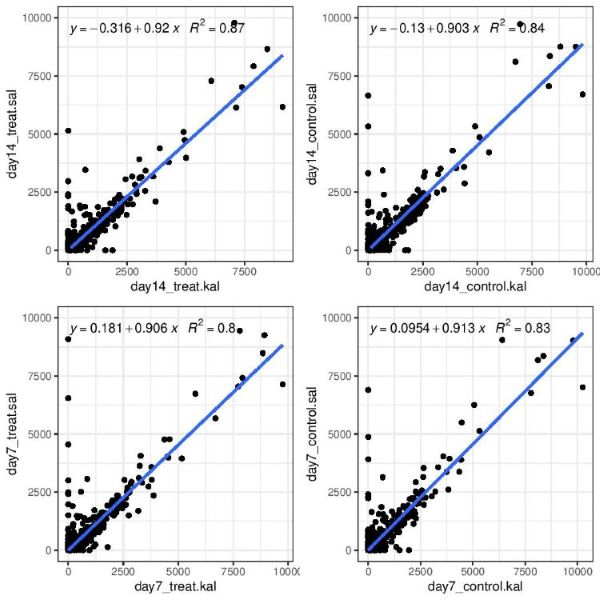
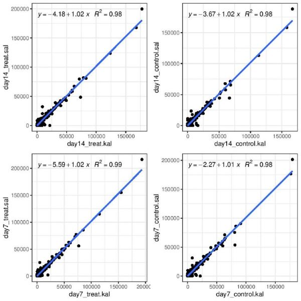
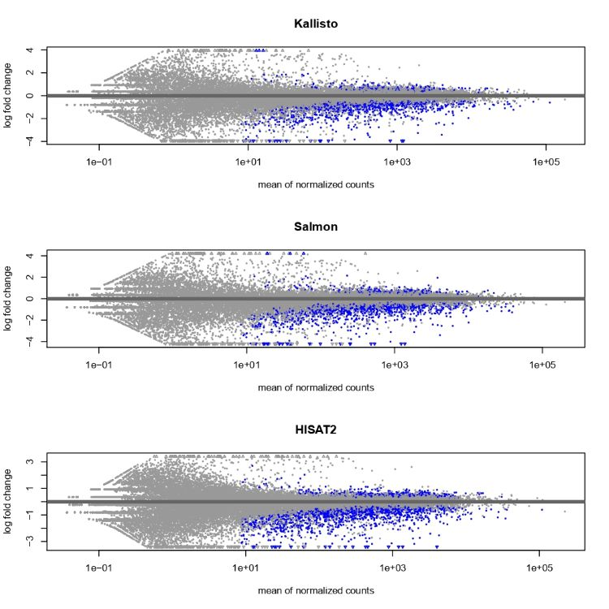
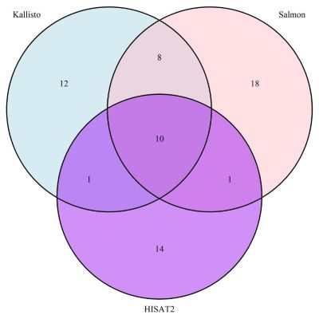
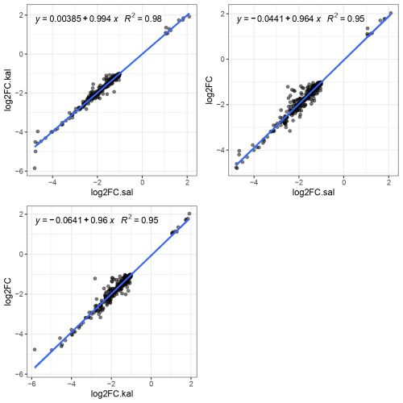
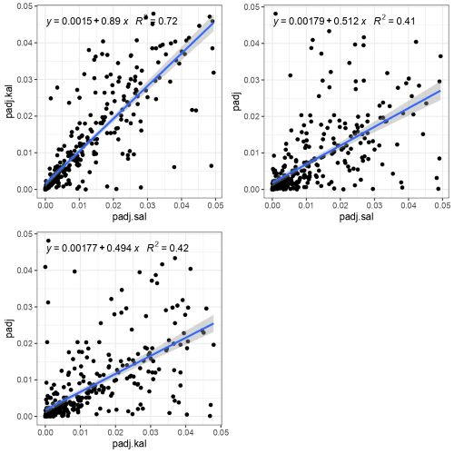

# Introduction

## Biological context 

Cancer immunotherapy and checkpoint blockade therapy specifically have recently emerged as a big part of the current arsenal of treatments available for cancer patients. (Korman et al., 2006)(Hargadon et al., 2018) By targeting the immmunosuppressive microenvironment through PD-L1 and CTLA-4 blockade, this class of therapy re-activates exhausted effector T-cells ultimately driving tumor regression.(Wei et al., 2018) Today, this therapeutic modality is no longer just a monotherapy. It has extended into combination therapies with small-molecules (Manni et al., 2018), other antibodies (Taylor et al., 2019), and even adoptive T-cell transfer. (Grosser et al., 2019) The biggest issue this therapy faces is the lack of understanding on who are most suited to receiving the treatment. Since this type of treatment relies on the presence of tumor infiltrating lymphocytes (TIL), the initial assumption was that the presence of TILs was sufficient for success, but that is not the case. More often than not patients that are supposed to respond to thsi theraputic stratergy will relapse despite the presesce of TILs. (Liu et al., 2019)

Taylor et al, tackles this through a better understanding of mouse models that can assess the efficacy of different combination therapies. In their study they sequenced CT26 tumors that were treated with or without checkpoint inhibitor blockades on day 7 and day 14 post treatment among a variety of other benchmarks. (Taylor et al., 2019) Although they went on to assess the status of different immune cells and pathway analysis as part of their characterization, this is not something replicated here. This project will use the day 7 isotype vs treatment data and assess the differentially expressed genes. They had 5 biological replicates for each group, so this analysis was performed on 10 samples total. 


## Scope of analysis

Quantifying differential gene expression is on of the most popular uses for RNA-seq analysis. The method of quantification, however, can vary vastly with the multitude of options currently available. The tools that perform initial quantification can be divided into two main classes, aligners (STAR, HISAT2) and psudoaligners (Salmon, Kallisto). If you chose an aligner for this first step you will need to use a counter to quantify this alignment (Stringtie, HTSeq-count, featureCounts), something a psudoaligners does automatically. At the next stage of analysis, you can use a variety of tools to perform differential gene expression analysis (edgeR, DESeq2). 

Each combination of tools has its own set of advantages and disadvantages and depending on the biological question being investigated there may be multiple paths that can provide the optimal answers. For example, if your goal were to find novel transcripts or splice variations, kallisto or salmon would not be an appropriate start to your pipeline since they discard all reads that do not match a reference transcriptome. In terms of biology, the accuracy of counts is the most important since this is the metric used to determine the specific differences between whatever condition you are testing. 

In this project three different aligners/psudoaligners specifically, HISAT2, Kallisto and Salmon will be compared. We will compare them based on the correlation of the following criteria:

1. Differentially expressed genes
2. Abundance and raw counts between kallisto and salmon
3. Calculated log2 fold change and adjusted p-value based on DESeq2 output 

## Note of Caution 

The methods section of this paper was not very specific on the settings and thresholds used when running their analysis. For this reason, most settings were left at the default level. The general tools used by the paper include Salmon, DESeq2 without any trimming. Here these basic things have also been followed. In addition, there was no gene list provided by the authors that detailed what genes they found as differentially expressed, so there was no way to compare their specific output to what was found here. They did provide overall numbers for significant genes, so that was used as a guide for what to expect from our analysis. 

# Pipeline 


We will be exploring three pipelines in this project. All the data was initially put through `FASTQC` to assess the quality of the run. We then processed the `.fastq` files. 

The Hierarchical Indexing for Spliced Alignment of Transcripts 2 (Kim et al., 2019) or HISAT2 route, as mentioned earlier, is an aligner that is splice aware and maps reads to a reference genome. It is based on the Ferragina Manzini index (FMI) that is the bases for bowtie2. This method takes `.fastq` data and aligns reads to the FMI for a given reference and generates a `.sam` file that tabulates the location of each read on each of the chromosomes. We then take this and use `Samtools` to convert this data into sorted and filtered `.bam` files that we count using the `featureCounts` function within the `Rsubread` Bioconductor package. The count data from this is used within `DESeq2` to generate `log2FoldChange` and `padj` values for comparisons between the control and treatment group on day 7. 

The other two methods used to generate counts are both psudoaligners. Salmon is one of the most popular methods used to quickly align and quantify transcript abundance in RNA-sequencing. (Patro et al., 2017) Unlike HISAT2 it aligns raw `. fastq` reads to the index of a supplied transcriptome using quasi-mapping and followed by a quantification of abundance. It can quantify `. bam` files but this is not a functionality used in this project. Counts generate here are once again supplied to DEseq2 for `log2FoldChange` and `padj` values for comparisons between the control and treatment group on day 7.

Kallisto is another psudoaligner that was used here to quantify abundance. (Bray et al., 2016) Similar to Salmon, it does not look for the specific coordinate position where the read maps to the genome. It maps to the transcriptome and quantifies abundance that are used within DEseq2. The motivation to choose these methods was to compare whether there are significant similarities or differences in what is called significant depending on the method used. 

# Methods

## FastQC 

`FastQC` was used to do initial analysis on the raw data quality. The`.html` output from this analysis can be found [here](./FASTQC). Most quality checks were fine for all the reads, there was a flag for the `Per base sequence content` but upon examination, the variation was only at the start of the read and the quality score in that region was still above 32 so no action was taken to specifically address this. Another flag that was raised was w.r.t the `Kmer Content`. These over-represented sequences were across the read and no flags were raised for adapters. No trimming was done in the paper this data was borrowed from, so nothing was done in this case as well. 

## HISAT2

The Hierarchical Indexing for Spliced Alignment of Transcripts 2 (Kim et al., 2019) or HISAT2 is an aligner that is splice aware and maps reads to a reference genome. It is based on the Ferragina Manzini index (FMI) that is the bases for bowtie2. HISAT2 is a splice-aware aligner, meaning it can map non-contiguous reads. Since the raw data has already been spliced and the full genome is provided as reference it has the capacity to find minor matches at the start or end of a given exon and map across to the next exon in a give gene. It accounts for minor SNPs and other variations in real RNA-seq data that is not necessarily represented in the reference sequence. 

Fig. 2 was borrowed from Kim et al., it shows the scheme used by HISAT2 to map reads to the reference. The key things to note here are that this tool created two indexes. There is the global index that places a read in a specific location of the genome (can be just 28bp) and a local index that has smaller section of the genome (can be 56 bp) to allow short overhangs of splice sites to be mapped accurately. 


First, the mm10 mouse reference genome from [gencode](https://www.gencodegenes.org/mouse/) was used within `hisat-build` to construct an index. 

```
hisat2-build -f mm10.ref.fa mm10
```
This index is then used within hisat2 for read mapping. This function can be customized in a variety of ways, full list of options found [here](https://daehwankimlab.github.io/hisat2/manual/). Here we used the following flags:

1. `-p` = specifies the number of threads to use. Default is 1. 
2. `-q` = tells the system that the input here are `.fastq` files 
3. `-U` = the list of files to be used as input 
4. `-S` = the destination for the `.sam` file that contains the alignment information for each sample
5. `-x` = specifies the prefix of the hisat2 index used in the previous step

```
hisat2 -p 8 -q -x mm10 -U ${sample_dir}/day7_control1.fastq -S ${out_dir}/day7_control1.sam
```

## Samtools

Samtools is a very useful set of programs that can handle SAM and BAM files in preparation for counting. Here some of the tools were used in order to process `.sam` files generated from HISAT2. Full list of functionalities can be found [here](https://www.htslib.org/).

Here four function were used in order to process the HISAT2 output: 

#### 1. SAM to BAM 

Converting `.sam` files into `.bam` files. A part of the samtools view function, this process takes two main arguments:

1. `-b` = indicates that input file is a `.bam` file
2. `-S` = directory where `.sam` file lives

```
samtools view -b -S ${sam_dir}/${base}.sam > ${bam_dir}/${base}.bam
```
#### 2. Sorting and Indexing BAM files

These functions sort and index BAM files based on the genomic coordinates for downstream filtering based on alignment quality, taking two main arguments: 

1. `-o` = destination for sorted file
2. `-b` = directory of sorted `.bam` file

```
samtools sort -o ${bam_sort}/${base}.bam ${bam_dir}/${base}.bam
samtools index -b ${bam_sort}/${base}.bam ${bam_sort}/${base}.bam.bai
```
These tools work well together in for loops so can be great to use at the same time. 

#### 3. Filtering BAM files 

The filter function is another feature built into samtools view. It is used to filter reads that did not map anywhere (MAPQ = 0) as well as reads that mapped in multiple locations of the genome (MAPQ = 1). Since HISAT2 generates three MAPQ scores, the unique reads being a MAPQ of 60 it can be easy to filter the rest out. There a many more parameters upon which filtering can be done. Since no parameters were provided by the authors no other settings were used here. 

To filter `.bam` files three arguments are needed: 

1. `-b` = indicates that input file is a `.bam` file
2. `-q` = the minimum number for the MAPQ score in order to keep in filtered list
3. `-o` = output directory for filtered files

```
samtools view -b -q 40 -o ${out_dir}/${base}.bam ${in_dir}/${base}.bam
```

## featureCounts

Feature counts is a commonly used software that can quantify `.bam` files. It can be run on the terminal or from within the `Rsubread` bioconductor package. It reports raw counts for reads mapping to a features specified by a supplied `.gtf` file for genome annotations. The tool uses the schematic in Fig. 3 to count reads. 


All filtered `.bam` files can be stored within a variable in R using the `file.path()` function. This can then be called within featureCounts along with: 

1. `annot.ext` = annotated `.gtf` file 
2. `isGTFAnnotationFile` = indication that annotation file is a `.gtf` 
3. `GTF.featureType` = type of feature to assign counts by. Can be genes or transcripts
4. `GTF.attrType` = count matrix will be generated based on this attribute
5. `countMultiMappingReads` = choice of whether to include sequences that map multiple times. Here we chose to do this because all reads that mapped multiple aspects of the genome have already been filtered out and choosing `FALSE` here can eliminate 20-30% of all data. 

```
featureCounts(bam_files, annot.ext = 'mm10.ref.gtf', 
  isGTFAnnotationFile = TRUE, 
  GTF.featureType = 'gene', 
  GTF.attrType = 'gene_id', 
  countMultiMappingReads = TRUE)

```

For more detail check out the Harvard Chan Bioinformatics core page on counting [here](https://hbctraining.github.io/Intro-to-rnaseq-hpc-O2/lessons/05_counting_reads.html)

Count matrix for all data can be found under `str_counts.csv` in the project repo. 

## Kallisto 

Kallisto is another psudoaligner that was used here to quantify abundance. (Bray et al., 2016) Instead of mapping to a specific location in the whole genome, it maps to the potiential position in the transcriptome. This means this method of mapping is much faster, but it also means, novel splice sites and transcripts are discarded if they do not already belong to the reference transcriptome. 

The kallisto index is builds a de Bruijin graph of k-mers. Mechanism of mapping is illustrated in Fig. 4 from Bray et al. Each circle represents a k-mer. Since the index stores the map of k-mers to their corresponding transcript and k-mers are used to extend the read along a path that leads to transcript identification. Unlike a classical aligner, kallisto combines the alignment and quantification under one function removing the need to secondary software before DESeq2 analysis. 


The index is build by simply supplying the transcriptome and `-i` indicates the prefix for the index file. 

```
kallisto index -i kal_index mm10.transcript.fa
```
This index is then called within kallisto quant. This function takes several arguments found [here](https://pachterlab.github.io/kallisto/manual). 

1. `-i` = directory that contains index files 
2. `-o` = output directory for quantification 
3. `--single` = in this case no sample was paired so this flag is necessary to indicate that
4. `-l` = since reads are not paired, average length needs to be provided. It is typically between 180 and 200 for illumina reads. Since Salmon analysis was performed first, this information was extracted with metadata. 
5. `-s` = standard deviation in `-l` value 
6. `-t` = number of threads to be used

```
kallisto quant -i ${index_dir} \
-o ${out_dir}/${basename} \
${sample_dir}/${basename}.fastq \
--single -l 250 -s 25 -t 16
```

All Kallisto counts can be found under `kallisto_counts` in the project repo. 

## Salmon

Salmon is another pseudoaligner that uses k-mer counting similar to kallisto. It claims to handle sample specific and GC bias better than kallisto. (Patro et al., 2017) It follows a similar quasimapping scheme at the start and then through the various online and offline phases arrives at the bias estimates. Fig. 5 from Patro et al. illustrates this process.


One advantage of salmon is that it can quantify both `.fastq` and `.bam` files generated from traditional aligners making it a versatile tool overall. To start the analysis as with all the tools discussed so far, an index is generated. Since this method uses a transcriptome. 

Salmon index takes two arguments:

1. `-t` = transcript file 
2. `-i` = index directory 

```
salmon index -t mm10.transcript.fa -i salmon_index
```
Once the index has been constructed, salmon quant can be run to get counts and abundance. Salmon quant has a variety of flags that can be used to customize the quantification process. Full list available [here](https://salmon.readthedocs.io/en/latest/salmon.html)

Salmon quant here took the following arguments:

1. `-i` = index directory 
2. `-r` = only used for single-stranded reads. Points to `.fastq` file 
3. `-p` = number of threads to be used 
4. `--validateMapping` = improves alignment specificity when mapping to transcriptome 
5. `--rangeFactorizingBins` = works in tandem with `--validateMapping` to improve the accuracy of abundance calculation
6. `--seqBias` = enables salmon to correct for sequence bias each time it runs a new sample
7. `-o` = output directory 

One flag we did not use here was `--gcBias` that was because it is still experimental for single-stranded reads. If our data was paired this would also have been included. 

```
salmon quant -i ${index_dir} -l A \
  -r ${sample_dir}/${base}.fastq \
  -p 16 --validateMappings --rangeFactorizationBins 4 \
  --seqBias \
  -o ${out_dir}/${base}_quant

```

All Salmon counts can be found under `salmon_counts` in the project repo. 

## DESeq2

DESEq2 was used as the primary tool for differential expression analysis since it was the choic of the original reference paper by Taylor et al. in tandem with `tximport` it made handling count data from Salmon and Kallisto. The count matrix from featureCounts was used with `DESeqDataSetFromMatrix()` to manually construct the matrix. For all three sets of count data, the following experimental setup was adopted: 

Sample|dpi|condition|group      
---|---|---|---
"day14_immuno_treat_1"  |  "14" |"Treatment" |"day14_treat"  
"day14_immuno_treat_2"  |  "14"| "Treatment" |"day14_treat"  
"day14_immuno_treat_3"  |  "14"| "Treatment"| "day14_treat"  
"day14_immuno_treat_4"  |  "14"| "Treatment" |"day14_treat"  
"day14_immuno_treat_5"  |  "14" |"Treatment" |"day14_treat"  
"day14_isotype_control_1" | "14"| "Control" |  "day14_control"
"day14_isotype_control_2" |  "14" |"Control"  | "day14_control"
"day14_isotype_control_3" |"14"| "Control" | "day14_control"
"day14_isotype_control_4"| "14"| "Control"  | "day14_control"
"day14_isotype_control_5"| "14"| "Control" |  "day14_control"
"day7_immuno_treat_1"   |  "7" | "Treatment" |"day7_treat"   
"day7_immuno_treat_2"   |  "7" | "Treatment" |"day7_treat"   
"day7_immuno_treat_3"   |  "7" | "Treatment" |"day7_treat"   
"day7_immuno_treat_4"   |  "7" | "Treatment"|"day7_treat"   
"day7_immuno_treat_5"    | "7" |  "Treatment"| "day7_treat"   
"day7_isotype_control_1" | "7" | "Control"  | "day7_control" 
"day7_isotype_control_2" | "7" | "Control"  | "day7_control" 
"day7_isotype_control_3" | "7" | "Control"  | "day7_control" 
"day7_isotype_control_4" | "7" | "Control"  | "day7_control" 
"day7_isotype_control_5" | "7" | "Control"  | "day7_control" 
 
To simplify analysis, `~group` was the standard model used to create the model matrix that was run on DESeq2. This was then interrogated using `results()` along with `contrast`:

```
results(out_salmon, contrast = list('groupday7_treat', 'groupday7_control'),
  independentFiltering=TRUE, alpha=0.05, pAdjustMethod="BH", parallel=TRUE)
```

# Results

All comparisons between pipeline were assessed on the R^2 value between comparable metrics. The goal of this exercise was to determine what was similar and what was different between the different counting methods. In some instances, it was not possible to compare certain information because that parameter was not generated as part of the count process. This was not as much of a problem when it came to DESeq2 outputs since at that point everything was once again standardized. Unlike Taylor et al. we do not go into pathway level analysis or anything beyond basic DGE. The crucial comparison at the end is the number of similar genes that were significantly differentialy expressed (i.e., log2FoldChange > 1 and padj < 0.05) across the three count methods employed. 

The first comparison made was between the raw counts and abundance generated by Kallisto and Salmon after the `tximport` prior to DGE analysis. Since these pseudoaligners are most similar in alignment method, but use slightly different methods of quantification, here the result of this difference was explored. For the sake of simplicity, biological replicates were collapsed into their respective groups prior to plotting.





In all the four samples compared here (Fig. 6 and 7), count data was very consistent with the R^2 above 0.98 across all samples. This can be accounts for from the similarity in the alignment mechanism between the two methods. The abundance values were also quite consistent with R^2 values above 0.80. This might indicate slight differences in how the two software handled the counts downstream to calculate transcripts per million (TMP) values.  

The next comparison between all three methods was done with a Ratio intensity or MA plot. (Fig. 8) As a general trend across the three methods, there seems to be broad consensus that the majority of significant genes are downregulated. The noise seems to be empirically higher in HISAT2 data. This might be down to the specific settings used to run `featureCounts`. 



This trend is also seen when we look that the common genes that are commonly up or down regulated between the three methods in Fig. 9 and 10, with the majority being down regulated (368 common genes across all three methods)




Overall, there seems to be more overlap in genes selected by Salmon and Kallisto vs these two methods and HISAT2. With over 200 genes in the HISAT2 category that do not seem to be present in the Salmon and Kallisto set. 

When the DEG common to all three analyses were compared for the calculated log2 fold change (log2FC) and adjusted p-values (padj), there was interesting trend where the log2FC was highly constant across genes (R^2 > 0.95), but the padj for the same genes were all under 0.05 but varied greatly in absolute value (R^2 ~ 0.4 - 0.7). (Fig 11 and 12)





When the top 20 genes that are selected by HISAT2 but not by the other two aligners are compared, you see a common trend where the log2FC is mostly similar across the board, but it is the adjusted p-value that caused the exclusion of these genes. In some cases (ENSMUSG00000039252) the adjusted p-value for Salmon and Kallisto was NA, for a positive log2FC but for HISAT2 the gene was significant and downregulated. 

Gene ID | log2FC.kal | padj.kal | log2FC.sal | padj.sal | log2FC.hisat2 | padj.hisat2
---|---|---|---|---|---|---
ENSMUSG00000020658 |	-1.356535|	0.53097689	|-1.357175	|6.111774e-01	|-1.000226 |	0.029095355
ENSMUSG00000015709|	-34.300029|	NA	|-33.589563	|2.890000e-12	|-1.014931	|0.012030225
ENSMUSG00000024044|	-7.558069|	0.14659854	|-6.668639	|NA	|-1.023715|	0.007608310
ENSMUSG00000030854|	-1.167033	|0.16784485	|-1.218756	|2.873419e-01	|-1.052755|	0.038806329
ENSMUSG00000053113|	-1.010064	|0.00343756	|-1.192120	|6.746481e-02	|-1.075291|	0.001207374
ENSMUSG00000026770|	-1.077229|	0.06709004	|-1.061079	|6.178079e-02	|-1.075449|	0.047186361
ENSMUSG00000037709|	-1.158644	|0.09655698	|-1.320613	|5.427227e-02	|-1.078484|	0.026103079
ENSMUSG00000024810|	-1.082532|	0.06440562|	-1.055606	|4.521379e-02	|-1.102773|	0.021926060
ENSMUSG00000097113|	-1.017096	|0.07880397	|-1.018722	|6.474304e-02	|-1.107354|	0.020556920
ENSMUSG00000039252|	2.394058|	NA|	3.183328	|NA	|-1.111985	|0.026702981
ENSMUSG00000035448|	-1.130945	|0.06308394	|-1.035933	|9.499252e-02	|-1.120976|	0.035099793
ENSMUSG00000080848|	-1.429144|	0.70390475|	-1.608505	|NA	|-1.124491	|0.035932036
ENSMUSG00000021675|	-1.010883|	0.10962906|	-1.132175|7.698013e-02	|-1.127357	|0.046448316
ENSMUSG00000090084|	-1.050869	|0.06038621|-1.160448	|3.970894e-02	|-1.135746|	0.028466701
ENSMUSG00000096929|	-1.251021|	0.22166135	|-1.018699	|2.904156e-01	|-1.139663	|0.029137355
ENSMUSG00000079033|	-1.312127	|0.07277804	|-1.167783|	2.159020e-01	|-1.149691|	0.029944489
ENSMUSG00000028713|	-1.122202	|0.07060479	|-1.141025|	6.148902e-02	|-1.152508|	0.029090021
ENSMUSG00000031442|	-1.153959	|0.04717234	|-1.051022|	1.388943e-01	|-1.153654	|0.004888088
ENSMUSG00000022144	|-1.092337	|0.02166857	|-1.927377|	NA	|-1.155644|	0.007176521
ENSMUSG00000038112	|-1.124223|0.12558901	|-1.137111|	1.721675e-01	|-1.168819|	0.032574158

# Discussion

In this project, we evaluated the differences in what genes were identified as differentially expressed based on the use of Salmon, Kallisto or HISAT2. The data indicated a strong correlation based on raw counts between the two psudoaligners, Salmon and Kallisto, and log2FolfChange values for genes that were found to be significant across all three methods. There were slightdifferences in abundance values when Salmon and Kallisto were compared, but there was an overall closer consensus between the psudoaligners on what is differentially expressed. Some differences may be present because Salmon accounts for sample specific biases throughout a run unlike Kallisto and uses a different quantification pipeline. HISAT2 may be identifying more genes over all because it is better at identifying genes that are lowly expressed compared to the two psudoaligners (Wu et al., 2018) leading to the overall higher number in DEG in the HISAT2 group. Depending on the biological question at hand this may or may not be of importance when choosing one method over the other. Ultimately repetiton of this analysis most be done with simulated dataset to have a ‘true’ value to compare against.

# Links 

All data and full analysis can be found at: [github.com/sk7-dotcom/Evaluating_RNAseq_aligners](https://github.com/sk7-dotcom/Evaluating_RNAseq_aligners)

[Methods](Methods.md) | [Count Generation](Count_generation.Rmd) | [DESeq2 pipeline](DESeq2_pipeline.Rmd) | [Comparisons](comparison_pipeline.Rmd)

# References 

Taylor, M. A. et al. Longitudinal immune characterization of syngeneic tumor models to enable model selection for immune oncology drug discovery. J Immunother Cancer 7, 328 (2019).


Kim, D., Paggi, J. M., Park, C., Bennett, C. & Salzberg, S. L. Graph-based genome alignment and genotyping with HISAT2 and HISAT-genotype. Nat Biotechnol 37, 907–915 (2019).


Patro, R., Duggal, G., Love, M. I., Irizarry, R. A. & Kingsford, C. Salmon provides fast and bias-aware quantification of transcript expression. Nat Methods 14, 417–419 (2017).


Bray, N. L., Pimentel, H., Melsted, P. & Pachter, L. Near-optimal probabilistic RNA-seq quantification. Nat Biotechnol 34, 525–527 (2016).


Love, M. I., Huber, W. & Anders, S. Moderated estimation of fold change and dispersion for RNA-seq data with DESeq2. Genome Biol 15, 550 (2014).


Wu, D. C., Yao, J., Ho, K. S., Lambowitz, A. M. & Wilke, C. O. Limitations of alignment-free tools in total RNA-seq quantification. Bmc Genomics 19, 510 (2018).


Wei, S. C., Duffy, C. R. & Allison, J. P. Fundamental Mechanisms of Immune Checkpoint Blockade Therapy. Cancer Discov 8, 1069–1086 (2018).


Manni, W., Liu, Y., Cheng, Y., Xiawei, W. & Yuquan, W. Immune checkpoint blockade and its combination therapy with small-molecule inhibitors for cancer treatment. Biochimica Et Biophysica Acta Bba - Rev Cancer 1871, 199–224 (2018).


Liu, D., Jenkins, R. W. & Sullivan, R. J. Mechanisms of Resistance to Immune Checkpoint Blockade. Am J Clin Dermatol 20, 41–54 (2019).


Hargadon, K. M., Johnson, C. E. & Williams, C. J. Immune checkpoint blockade therapy for cancer: An overview of FDA-approved immune checkpoint inhibitors. Int Immunopharmacol 62, 29–39 (2018).


Korman, A. J., Peggs, K. S. & Allison, J. P. Checkpoint Blockade in Cancer Immunotherapy. Adv Immunol 90, 297–339 (2006).


Grosser, R., Cherkassky, L., Chintala, N. & Adusumilli, P. S. Combination Immunotherapy with CAR T Cells and Checkpoint Blockade for the Treatment of Solid Tumors. Cancer Cell 36, 471–482 (2019).
  


  
  
  
  
  
  
  
  
